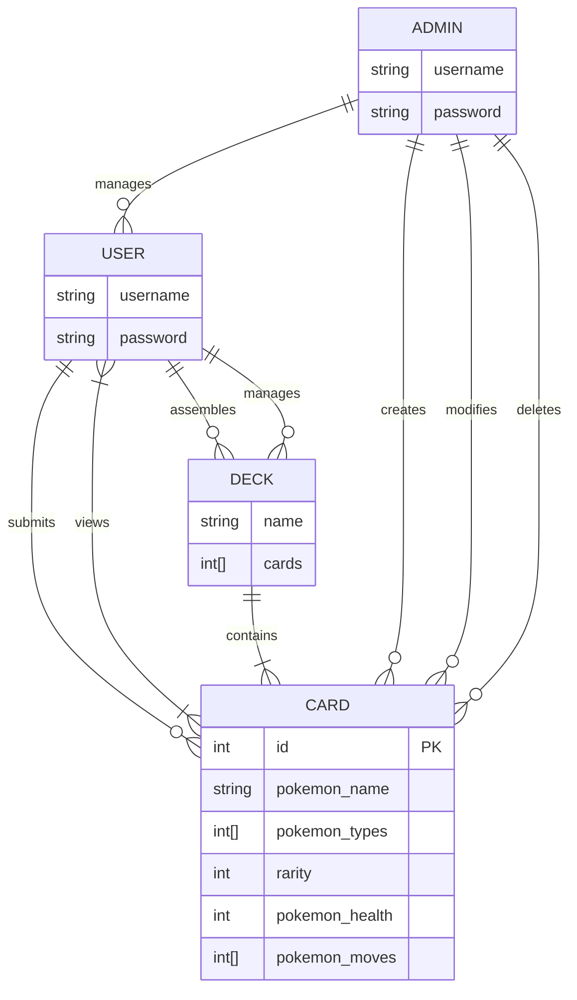
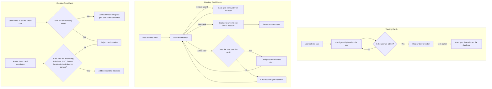
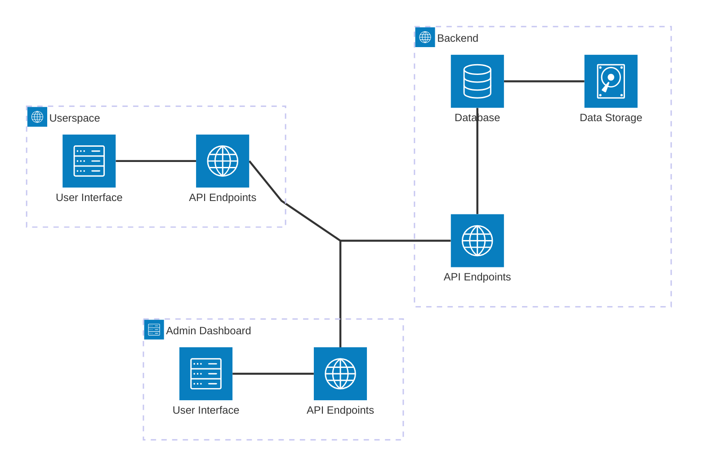

# Pokémon Card Storage Web App
### Entity-Relationship Diagram

### User Flow Diagram

### System Architecture Diagram

### API Endpoints Table
| Endpoint | HTTP Method | Requirements
|----------|-------------|-------------
| Fetch Pokémon cards | `GET` | None
| Create card deck | `POST` | User
| Update card deck | `POST` | User
| Save card deck | `POST` | User
| Submit card request | `POST` | User
| Add new card | `POST` | Administrator
| Delete card | `POST` | Administrator
| Fetch card submissions | `GET` | Administrator
| Accept/reject card submission | `POST` | Administrator
